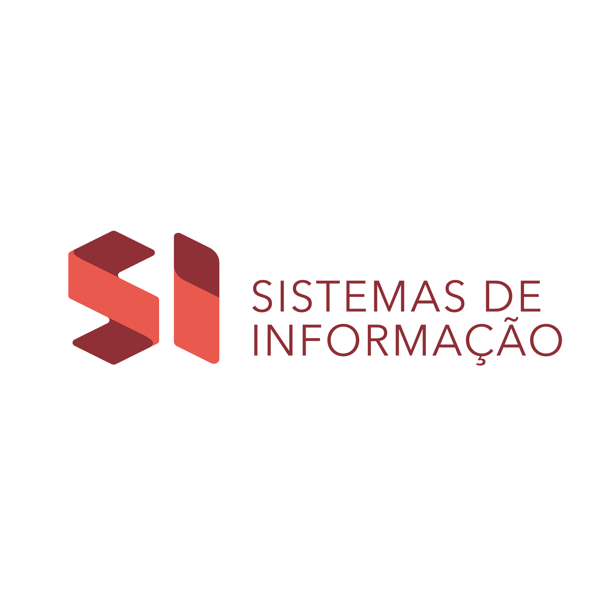

**Sistemas de informação - UFPB - Campus IV**

Repositório onde ficarão disponíveis meus scripts desenvolvidos durante o semestre.

Matéria: Introdução à programação;

Linguagem: Python;

Primeiro período.
